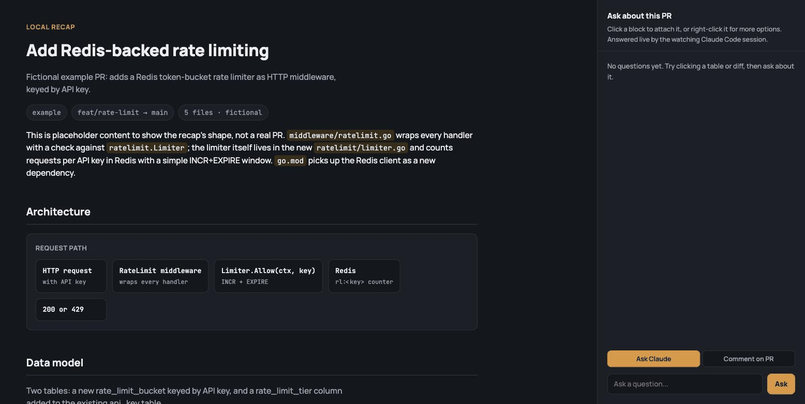

# local-recap

A [Claude Code](https://claude.com/claude-code) skill that turns a PR diff into a fully local, interactive recap page — with a live chat panel you can actually talk to, right-click "jump to the exact lines on GitHub" links, and an optional "comment on PR" flow that posts real review comments.

No hosted viewer, no Claude Artifacts, **no API key.** The page's chat is answered by the Claude Code session that built it: the browser talks to a tiny local Python server, the server queues your question, the agent (watching the queue) answers it by actually reading the code, and the page polls for the reply.

Built on top of [Builder.io](https://www.builder.io)'s [`visual-recap`](https://github.com/BuilderIO/agent-native) skill — this is a localhost-first fork, not an independent implementation. All credit for the original recap concept (turning a diff into structured, block-based review content) goes to Builder.io; see [Why](#why) below for exactly what changed and why.

<p align="center">
  
</p>

<p align="center"><sub>Demo runs against the fictional example in <code>example/</code> — no real repo's data.</sub></p>

## Why

[`visual-recap`](https://github.com/BuilderIO/agent-native), by Builder.io, publishes recaps through a hosted Plan viewer with polished ERD/diff renderers — genuinely nicer output, but you can't extend it, and there's no way to run it on localhost. Claude Artifacts' `sample` capability gives a page live Claude chat, but only when served through claude.ai, and it bills per call.

`local-recap` trades the polished renderers for full locality: everything is one static HTML page plus a ~150-line stdlib-only Python server. The tradeoff is real — chat answers only arrive while a Claude Code session is actively watching the queue. This is a personal dev tool, not a hosted service.

## What it does

- **Click any table, file, or diff** to attach it as context, then ask Claude a question about it in the side panel. Answered live, grounded in the actual repo (not guessed from the name).
- **Right-click any block** for a menu: add to chat context, or jump straight to the real lines on GitHub (`blob/<sha>/<path>#L<start>-L<end>` for exact lines, or the PR's Files-changed tab for a whole file).
- **Per-line annotation markers** — hover a small "i" badge on a diff/code line to see a note about *why* that line matters, not just what it does.
- **"Comment on PR" mode** — write a comment, review the exact body in a confirmation panel, and only on explicit confirm does it post a real comment to the real PR via your already-authenticated `gh` CLI. Never posts silently.

## Install

```
git clone https://github.com/ForisKuang/local-recap ~/.claude/skills/local-recap
```

That's it — `SKILL.md` is picked up by Claude Code automatically. Ask Claude something like *"build a local recap of PR #42"* and it takes it from there: gathers the real diff, authors `index.html`, starts the server, and watches the question queue for the rest of your session.

## Try the example first

The `example/` folder has a small, entirely fictional PR (a Redis rate limiter) so you can see the output shape without pointing this at a real repo:

```
cd example
python3 build_example.py
python3 ../scripts/server.py output 8990
```

Then open `http://127.0.0.1:8990`. Chat won't answer anything (no agent is watching this queue) but you can click around, right-click a block, and see the layout. "Comment on PR" and "view source" are both disabled in the example (no real repo is wired up).

## How it works

```
index.html  (built per-PR, hand-authored per SKILL.md's conventions)
    |
    |  fetch('/ask', ...)  ---->  queue/questions.jsonl  <---- tail -F, watched by
    |  fetch('/comment', ...)                                  a live Claude Code
    |                                                            session
    v
scripts/server.py  (stdlib http.server, no deps)
    |
    |  POST /comment  ---->  gh pr comment <pr> -R <repo> -F -
    v
your already-authenticated `gh` CLI
```

- `SKILL.md` — the full workflow Claude Code follows: gather the diff, author the page, start the server, watch the queue, answer questions, gate PR comments behind a confirmation.
- `scripts/server.py` — serves the page, brokers `/ask` + `/answer/<id>` (the chat queue) and `/comment` (shells out to `gh`, only when `recap.json` in the content dir names a `repo`/`pr`).
- `example/` — the fictional demo above, and a working reference for the templating pattern (`template.html` + a Python build script) if you want to see exactly how a real one gets assembled.

## Safety notes

- The server only ever calls `gh`, using whatever account is already authenticated on your machine. It never asks for or stores a token.
- Posting a PR comment always goes through an in-page confirmation panel showing the exact body — there is no code path that posts on a bare click.
- Nothing here calls any LLM API. The "AI" is literally your own running Claude Code session; if no session is watching the queue, chat just sits pending.

## License

MIT — see [LICENSE](LICENSE).
